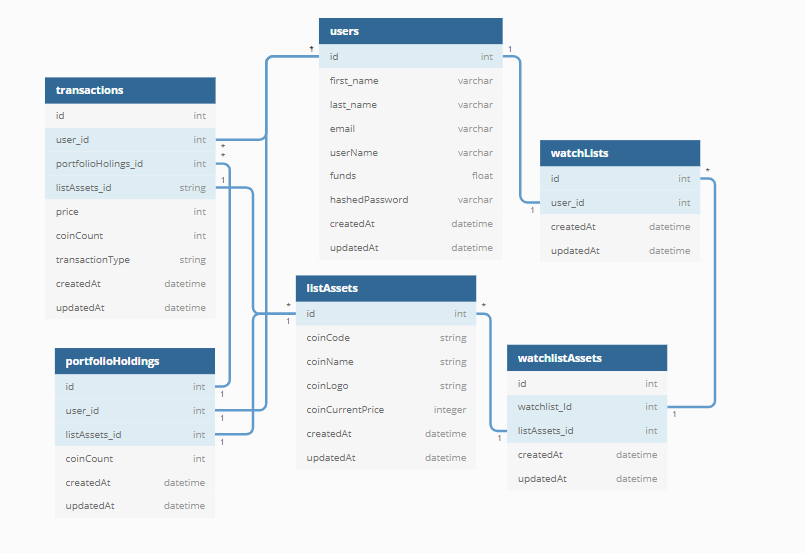

# `Users`

| Column Name      | Data Type | Details               | Description           |
| ---------------- | --------- | --------------------- | --------------------- |
| `id`             | integer   | not null, primary key | Users unique id       |
| `first_name`     | string    | not null              | Users first name      |
| `last_name`      | string    | not null              | Users last name       |
| `funds`          | float     | not null, default 0.0 | Users available funds |
| `email`          | string    | not null, unique      | Users email           |
| `username`       | string    | not null, unique      | Users username        |
| `hashedPassword` | string    | not null              | Users hashed password |
| `createdAt`      | datetime  | not null              | timestamp             |
| `updatedAt`      | datetime  | not null              | timestamp             |

# `WatchLists`

| Column Name     | Data Type | Details               | Description                              |
| --------------- | --------- | --------------------- | ---------------------------------------- |
| `id`            | integer   | not null, primary key | Watchlists unique id                     |
| `user_id`       | integer   | not null, foreign key | User that the watchlist belongs to       |
| `listAssets_id` | integer   | not null, foreign key | Coin that belongs to the users watchlist |
| `createdAt`     | datetime  | not null              | timestamp                                |
| `updatedAt`     | datetime  | not null              | timestamp                                |

# `ListAssets`

| Column Name | Data Type | Details               | Description            |
| ----------- | --------- | --------------------- | ---------------------- |
| `id`        | integer   | not null, primary key | ListAssets unique id   |
| `coinCode`  | string    | not null              | Coin code of the asset |
| `createdAt` | datetime  | not null              | timestamp              |
| `updatedAt` | datetime  | not null              | timestamp              |

# `Transactions`

| Column Name            | Data Type | Details               | Description                              |
| ---------------------- | --------- | --------------------- | ---------------------------------------- |
| `id`                   | integer   | not null, primary key | Transactions unique id                   |
| `user_id`              | integer   | not null, foreign key | User that that transaction belongs to    |
| `coinCode`             | string    | not null              | Coin code of the asset                   |
| `price`                | integer   | not null              | Price of the coin at time of transaction |
| `coinCount`            | integer   | not null              | How many coins were traded/bought/sold   |
| `portfolioHoldings_id` | integer   | not null, foreign key | What portfolio does the asset belong to  |
| `createdAt`            | datetime  | not null              | timestamp                                |
| `updatedAt`            | datetime  | not null              | timestamp                                |

# `PortfolioHoldings`

| Column Name    | Data Type | Details               | Description                           |
| -------------- | --------- | --------------------- | ------------------------------------- |
| `id`           | integer   | not null, primary key | PortfolioHoldings unique id           |
| `user_id`      | integer   | not null, foreign key | User that that transaction belongs to |
| `coinCode`     | string    | not null, unique      | Coin code of the asset                |
| `coinCount`    | integer   | not null              | How many of one coin is held          |
| `averagePrice` | integer   | not null              | Average cost of coin purchase         |
| `averagePrice` | integer   | not null              | Average cost of coin purchase         |
| `createdAt`    | datetime  | not null              | timestamp                             |
| `updatedAt`    | datetime  | not null              | timestamp                             |

  

